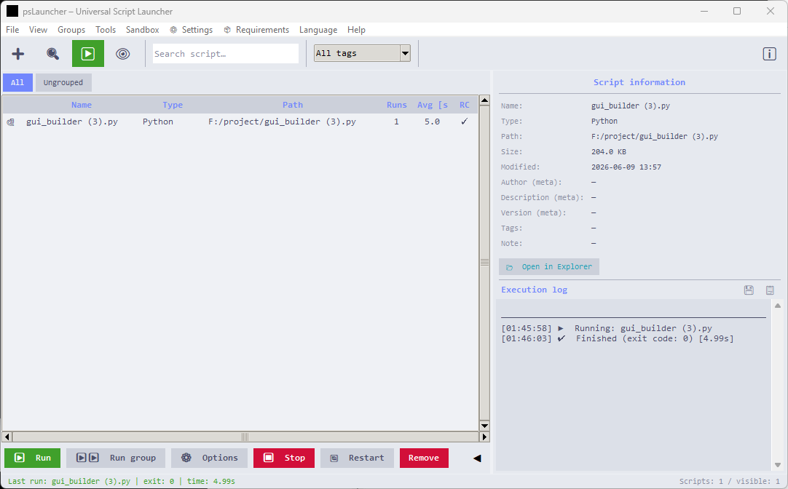

# psLauncher

**Portable, Windows-focused script launcher and sandbox manager.**

psLauncher is a lightweight Python/Tkinter desktop application that helps you organize, launch, and monitor scripts written in many scripting languages from a single searchable interface.



---

> This README is available in English and Polish. For the Polish version, see the section at the end of the file.

## What this repository contains

- `psLauncher.py` — main application source code
- `sandbox.py` — sandbox module for ad-hoc command/script execution
- `psLauncher.ico` — application icon used for packaging
- `README.md` — project documentation
- `screenshot.png` — preview image
- `app/psLauncher v1.5.7.exe` — current packaged executable

This repo does not currently include build scripts like `build.bat` or `psLauncher.spec`.

---

## Features

### Script management
- Add individual scripts or scan an entire directory tree recursively
- Supports many script types, including `.py`, `.ps1`, `.bat`, `.cmd`, `.vbs`, `.js`, `.rb`, `.pl`, `.sh`, `.bash`, `.r`, `.php`, `.lua`, `.tcl`, `.ts`, `.go`, `.java`, `.cs`, `.csx`, `.coffee`, `.exs`, and more
- Real-time search and filtering across the script library
- Custom groups and filters for organizing scripts
- Rename, duplicate, or remove entries without modifying the original file
- Export and import the script list as JSON for backup or sharing

### Execution
- Per-script runtime options: interpreter, arguments, working directory, output encoding
- Run with elevated rights on Windows (UAC)
- Hidden-window execution for background tasks
- Per-script PowerShell execution policy handling
- Automatic process timeout and kill after N seconds
- Auto-restart on crash for selected scripts
- Stop and restart running processes from the UI

### Sandbox mode
- Built-in scratchpad window for ad-hoc commands and scripts
- Supports script execution via detected interpreters
- Includes runtime helpers for interpreter discovery and output logging
- Use `runners` in the sandbox to list detected interpreters

### Monitoring & diagnostics
- Timestamped execution log
- Export logs to a file
- Per-script run history and statistics
- Live code preview and metadata extraction from source comments

### Interface
- Polish / English runtime language support
- Optional drag-and-drop additions when `tkinterdnd2` is installed
- Optional desktop notifications when `plyer` is installed
- Optional global hotkeys when `keyboard` is installed
- Rich right-click context menu for script actions

---

## Supported sandbox script types
The sandbox module in this repository supports many common script types, including:

- Windows batch / command scripts: `.bat`, `.cmd`
- PowerShell: `.ps1`
- Python: `.py`
- VBScript / Windows Script Host: `.vbs`, `.wsf`, `.hta`
- Shell scripts: `.sh`
- JavaScript: `.js`
- Lua: `.lua`
- Ruby: `.rb`
- Perl: `.pl`
- PHP: `.php`
- R: `.r`, `.R`
- Tcl: `.tcl`
- Go: `.go`
- Java: `.java`
- .NET Script: `.cs`, `.csx`
- TypeScript: `.ts`
- CoffeeScript: `.coffee`
- Elixir: `.exs`

---

## Installation

### Option 1 — Run the existing packaged executable
The repository already contains a packaged executable at `app/psLauncher v1.5.7.exe`. You can run it directly on Windows without installing anything else.

### Option 2 — Run from source
Requires Python 3.10+ on Windows.

```powershell
py -3 psLauncher.py
```

### Option 3 — Build your own executable
Install PyInstaller and optionally the extra UI libraries:

```powershell
py -3 -m pip install pyinstaller tkinterdnd2 plyer keyboard
py -3 -m pyinstaller --onefile --windowed --icon=psLauncher.ico psLauncher.py
```

The resulting executable will appear in `dist/psLauncher.exe`.

---

## Usage

1. Launch `psLauncher.exe` or run `py -3 psLauncher.py`.
2. Add scripts manually or scan a folder to populate the script library.
3. Select a script and press `F5` / `Enter` or use the toolbar buttons to run it.
4. Use the sandbox (`Sandbox` menu) for ad-hoc commands and interpreter discovery.
5. Export/import your script list or logs as needed.

---

## Project structure

```
psLauncher/
├── app/
│   └── psLauncher v1.5.7.exe   # Packaged Windows executable
├── psLauncher.py               # Main application source
├── sandbox.py                  # Sandbox module for ad-hoc execution
├── psLauncher.ico              # Application icon
├── README.md                   # Project documentation
└── screenshot.png              # Demo screenshot
```

---

## Requirements

- Windows 10 / 11 (primary target platform)
- Python 3.10+ to run from source
- `tkinter` included with standard Python on Windows

Optional runtime dependencies:
- `tkinterdnd2` — drag-and-drop support
- `plyer` — desktop notifications
- `keyboard` — global hotkeys

---

## Notes

- This repository is focused on the source code and the packaged executable.
- If a dependency is missing, the application falls back gracefully to built-in behavior.
- The current version in source is `1.5.7`.

---

## License

© 2026 Sebastian Januchowski & polsoft.ITS™. All rights reserved.

---

## Author

**Sebastian Januchowski** — polsoft.ITS™ Group
GitHub: [polsoft-seb07uk](https://github.com/polsoft-seb07uk)
Contact: polsoft.its@fastservice.com

---

## Polska wersja dokumentacji

# psLauncher

**Przenośny menedżer i uruchamiacz skryptów dla Windows.**

psLauncher to lekka aplikacja desktopowa napisana w Pythonie i Tkinterze, która pomaga organizować, uruchamiać i monitorować skrypty w różnych językach skryptowych z poziomu jednego wyszukiwanego interfejsu.


---

## Co zawiera to repozytorium

- `psLauncher.py` — główny kod aplikacji
- `sandbox.py` — moduł sandbox do uruchamiania poleceń i skryptów w trybie testowym
- `psLauncher.ico` — ikona aplikacji używana przy pakowaniu
- `README.md` — dokumentacja projektu
- `screenshot.png` — obrazek podglądu
- `app/psLauncher v1.5.7.exe` — obecnie spakowany plik wykonywalny

To repozytorium nie zawiera obecnie skryptów budujących takich jak `build.bat` czy `psLauncher.spec`.

---

## Funkcje

### Zarządzanie skryptami
- Dodawanie pojedynczych skryptów lub skanowanie całej struktury katalogów rekursywnie
- Obsługa wielu typów skryptów, w tym `.py`, `.ps1`, `.bat`, `.cmd`, `.vbs`, `.js`, `.rb`, `.pl`, `.sh`, `.bash`, `.r`, `.php`, `.lua`, `.tcl`, `.ts`, `.go`, `.java`, `.cs`, `.csx`, `.coffee`, `.exs` i innych
- Wyszukiwanie i filtrowanie listy skryptów w czasie rzeczywistym
- Grupowanie skryptów i filtry do porządkowania biblioteki
- Zmiana nazwy, duplikowanie lub usuwanie wpisów bez modyfikowania oryginalnych plików
- Eksport i import listy skryptów jako JSON do backupu lub przenoszenia między maszynami

### Uruchamianie
- Opcje uruchamiania per skrypt: interpreter, argumenty, katalog roboczy, kodowanie wyjścia
- Uruchamianie z podwyższonymi uprawnieniami na Windows (UAC)
- Ukryte okno dla zadań działających w tle
- Obsługa polityki wykonywania PowerShell dla każdego skryptu osobno
- Automatyczne zakończenie procesu po określonym czasie
- Automatyczny restart po awarii dla wybranych skryptów
- Zatrzymywanie i ponowne uruchamianie procesów bezpośrednio z interfejsu

### Tryb sandbox
- Wbudowane okno sandbox do wykonywania poleceń i skryptów ad-hoc
- Obsługa uruchamiania skryptów przez wykryte interpretery
- Narzędzia do wykrywania interpreterów i rejestrowania wyników
- Polecenie `runners` w sandboxie wyświetla wykryte interpretery

### Monitorowanie i diagnostyka
- Log wykonania z czasem
- Eksport logów do pliku
- Historia uruchomień per skrypt i statystyki
- Podgląd kodu i ekstrakcja metadanych z komentarzy w plikach

### Interfejs
- Obsługa języka polskiego i angielskiego w runtime
- Opcjonalny drag-and-drop przy zainstalowanej bibliotece `tkinterdnd2`
- Opcjonalne powiadomienia pulpitu przy `plyer`
- Opcjonalne globalne skróty klawiaturowe przy `keyboard`
- Rozbudowane menu kontekstowe prawego przycisku myszy dla akcji na skryptach

---

## Obsługiwane typy skryptów w sandboxie
Moduł sandbox w tym repozytorium obsługuje wiele popularnych typów skryptów, w tym:

- Skrypty wsadowe Windows: `.bat`, `.cmd`
- PowerShell: `.ps1`
- Python: `.py`
- VBScript / Windows Script Host: `.vbs`, `.wsf`, `.hta`
- Skrypty shell: `.sh`
- JavaScript: `.js`
- Lua: `.lua`
- Ruby: `.rb`
- Perl: `.pl`
- PHP: `.php`
- R: `.r`, `.R`
- Tcl: `.tcl`
- Go: `.go`
- Java: `.java`
- .NET Script: `.cs`, `.csx`
- TypeScript: `.ts`
- CoffeeScript: `.coffee`
- Elixir: `.exs`

---

## Instalacja

### Opcja 1 — Uruchom istniejący plik wykonywalny
Repozytorium zawiera już spakowany plik wykonywalny w `app/psLauncher v1.5.7.exe`. Możesz uruchomić go bezpośrednio na Windows bez dodatkowej instalacji.

### Opcja 2 — Uruchom z kodu źródłowego
Wymagany Python 3.10+ na Windows.

```powershell
py -3 psLauncher.py
```

### Opcja 3 — Zbuduj własny plik wykonywalny
Zainstaluj PyInstaller oraz opcjonalne biblioteki UI:

```powershell
py -3 -m pip install pyinstaller tkinterdnd2 plyer keyboard
py -3 -m pyinstaller --onefile --windowed --icon=psLauncher.ico psLauncher.py
```

Powstały plik wykonalny pojawi się w `dist/psLauncher.exe`.

---

## Użycie

1. Uruchom `psLauncher.exe` lub `py -3 psLauncher.py`.
2. Dodaj skrypty ręcznie lub przeskanuj folder, aby wypełnić bibliotekę skryptów.
3. Wybierz skrypt i naciśnij `F5` / `Enter` albo użyj przycisków w pasku narzędzi.
4. Użyj sandboxa (menu `Sandbox`) do poleceń ad-hoc i wykrywania interpreterów.
5. Eksportuj/importuj listę skryptów lub logi w razie potrzeby.

---

## Struktura projektu

```
psLauncher/
├── app/
│   └── psLauncher v1.5.7.exe   # Spakowany plik wykonywalny na Windows
├── psLauncher.py               # Główny kod aplikacji
├── sandbox.py                  # Moduł sandbox do uruchamiania ad-hoc
├── psLauncher.ico              # Ikona aplikacji
├── README.md                   # Dokumentacja projektu
└── screenshot.png              # Zrzut ekranu
```

---

## Wymagania

- Windows 10 / 11 (główna platforma)
- Python 3.10+ do uruchamiania ze źródła
- `tkinter` dołączony do standardowego Pythona na Windows

Opcjonalne zależności runtime:
- `tkinterdnd2` — wsparcie drag-and-drop
- `plyer` — powiadomienia pulpitu
- `keyboard` — globalne skróty klawiszowe

---

## Uwagi

- To repozytorium koncentruje się na kodzie źródłowym i spakowanym pliku wykonywalnym.
- Jeśli brakuje zależności, aplikacja przejdzie do trybu podstawowego.
- Aktualna wersja w źródle to `1.5.7`.

---

## Licencja

© 2026 Sebastian Januchowski & polsoft.ITS™. Wszelkie prawa zastrzeżone.

---

## Autor

**Sebastian Januchowski** — polsoft.ITS™ Group
GitHub: [polsoft-seb07uk](https://github.com/polsoft-seb07uk)
Kontakt: polsoft.its@fastservice.com
